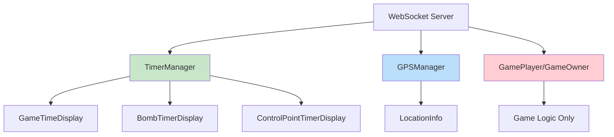

# Plan de Refactorización - Componentes Timer y GPS

## Problema Identificado
Los componentes padre [`GamePlayer`](src/components/GamePlayer.tsx) y [`GameOwner`](src/components/GameOwner.tsx) se refrescan innecesariamente cuando:
- Los timers se actualizan (cada segundo)
- La posición GPS cambia
- Los timers de bombas se actualizan
- Los timers de puntos de control cambian

## Causa Raíz
1. **Estado Centralizado**: Todos los datos de timers y GPS fluyen a través de [`useGamePlayer`](src/hooks/useGamePlayer.ts) y [`useGameOwner`](src/hooks/useGameOwner.ts)
2. **Manipulación Directa del DOM**: Los hooks de timers manipulan elementos DOM directamente
3. **Actualizaciones en Cascada**: Los eventos WebSocket activan re-renders en toda la aplicación

## Solución: Arquitectura de Componentes Aislados

### Componentes Nuevos a Crear

#### 1. TimerManager
**Ubicación**: `src/components/TimerManager.tsx`
**Responsabilidades**:
- Manejar conexiones WebSocket específicas para timers
- Gestionar estado interno de todos los timers
- Proporcionar datos a componentes hijos de timers
- Sin manipulación directa del DOM

#### 2. GPSManager
**Ubicación**: `src/components/GPSManager.tsx`
**Responsabilidades**:
- Seguimiento GPS independiente
- Manejar actualizaciones de posición vía WebSocket
- Proporcionar datos al componente LocationInfo

### Componentes a Refactorizar

#### GameTimeDisplay
- Convertir a componente puro de React
- Usar estado interno en lugar de manipulación DOM
- Recibir datos desde TimerManager

#### LocationInfo
- Mantener como componente puro
- Recibir datos desde GPSManager

### Flujo de Datos Optimizado

### Beneficios Esperados

#### Antes (Problemas Actuales)
- Los componentes padre se re-renderizan en cada tick de timer
- Las actualizaciones GPS causan re-renders en cascada
- Flickering visual en displays de timers
- Rendimiento pobre durante gameplay activo

#### Después (Resultados Esperados)
- Los componentes padre solo se re-renderizan con cambios de estado del juego
- Los componentes de timers se actualizan independientemente
- Las actualizaciones GPS aisladas al componente LocationInfo
- Displays de timers suaves sin flickering
- Rendimiento general mejorado

## Plan de Implementación

### Fase 1: Crear Componentes Base
1. Crear `TimerManager.tsx` con manejo WebSocket aislado
2. Crear `GPSManager.tsx` con seguimiento GPS independiente
3. Refactorizar `GameTimeDisplay` para usar estado React puro

### Fase 2: Integración
1. Actualizar `GamePlayer.tsx` para usar nuevos managers
2. Actualizar `GameOwner.tsx` para usar nuevos managers
3. Remover lógica de timers/GPS de hooks principales

### Fase 3: Pruebas y Validación
1. Verificar que componentes padre no se re-renderizan con updates de timers
2. Confirmar que GPS updates solo afectan LocationInfo
3. Validar funcionalidad completa del juego

## Archivos a Modificar

### Nuevos Archivos
- `src/components/TimerManager.tsx`
- `src/components/GPSManager.tsx`

### Archivos a Modificar
- `src/components/GamePlayer.tsx`
- `src/components/GameOwner.tsx` 
- `src/components/GameTimeDisplay.tsx`
- `src/hooks/useGamePlayer.ts` (remover lógica de timers/GPS)
- `src/hooks/useGameOwner.ts` (remover lógica de timers/GPS)

### Archivos a Eliminar/Refactorizar
- `src/hooks/useBombTimers.ts` (integrar en TimerManager)
- `src/hooks/useControlPointTimers.ts` (integrar en TimerManager)
- `src/hooks/useGameTime.ts` (integrar en TimerManager)
- `src/hooks/useGPSTracking.ts` (integrar en GPSManager)

## Métricas de Éxito

### Técnicas
- Monitorear re-renders con React DevTools
- Medir tiempos de render con Performance tab
- Contar re-renders de componentes padre

### Funcionales
- Timers actualizan sin flickering
- GPS funciona independientemente
- Estado del juego se mantiene funcional
- Performance mejorada durante gameplay